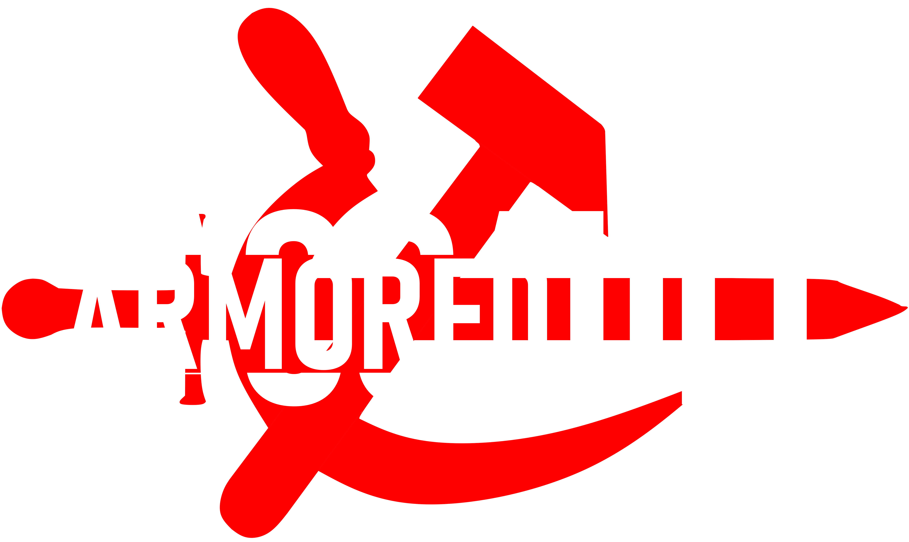
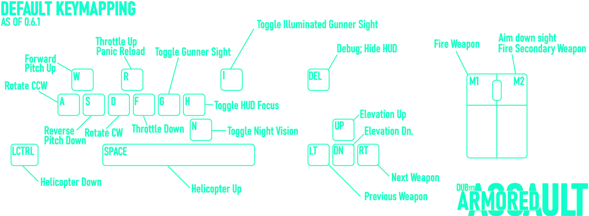

# Armored Assault
Redefining Combat with a Combined-Arms Approach.

This is where you will be able to find all experimental builds of the Armored Assault mod and full documentation and wiki-coverage of the inner-workings of the main mod and Antistasi.

## Content
### Weapons
### Vehicles
#### Fixed-Wing
#### Helicopter
#### Medium & Heavy Armor
#### Light Armor
#### Cars

## Antistasi
Loosely based on the gamemode of the same name for ArmA 3, Antistasi is a toggleable dynamic campaign for survival that allows for various computer-controlled factions to invade the map or aid in its defense.

### Factions
-  #### 7th MEU (BLUFOR)
-  #### 40th Army (OPFOR)
-  #### Front for Armed Struggle (INDFOR)

## Controls

## 

### All Rights Reserved - Viva l'Algérie
